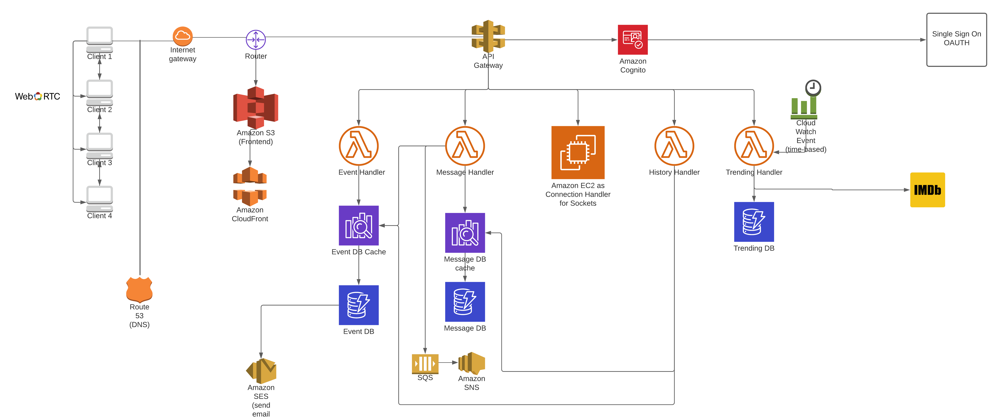
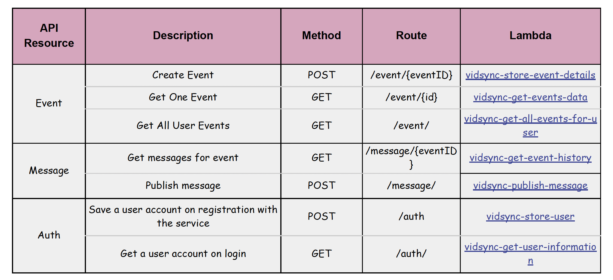

# Virtual-Cinema-Application

### What is Virtual Cinema?
When was the last time you visited a movie theatre? <br>
  - Virtual cinema brings the cinema experience to your room with all the intimate interactions at the movies 
   between you and your loved ones. 
  - This web app allows hosting a virtual watch party, similar to the popular Netflix Party chrome extension, but with more features for a cherishable experience.
  - Here friends can watch together the videos from websites which allow video embedding – YouTube, Vimeo, Streamable, and even from Facebook! 
### Application Demo
https://www.youtube.com/watch?app=desktop&v=l3i_CE1B1TU&feature=youtu.be
### Features Supported
  - User Login and Authentication
  - Creating new Youtube watch party
  - Inviting friends over email for Youtube watch party
  - Displaying user’s upcoming streams
  - Displaying user’s previous watch history
  - Messages logs of previous watch party
  - Video synchronization using Socket Programming
  - Any participant can pause the video, can go forward and backward (for all participants)
  - Supporting ‘reaction’ animation on video player
  - All Users’ live video and Audio feed
  
### Outline
  - A user sets up a link to a video and invites family, friends, or their loved ones to join. 
    - The host can invite users via SMS or email and set a particular time to start the video (similar to scheduled zoom meetings). 
    - By default, the video continues to play from when the users joined – just like what happens when you hop onto a YouTube live.
  - When the watch party is started – the friends can type into the chat box their reactions – just like the live chat in YouTube live video.
  - Users will be able to control the playback and speed of the video, which will be automatically synced.
  - Users also can chat over voice, similar to the discord VoIP feature, to simulate the experience of laughing or being terrified at particular scenes.
  - Users can choose to join with real time video for purposes of recording a reaction video with participants. 
    - After the video finishes, users will also have an option to export a recording of the entire session to share as a reaction video.
  - Just like a subtitle file (e.g. .srt file extension), which we often see for movies, which store text for a video accompanied by its timestamps; 
    - we similarly store all the reactions (can be text/gifs/photos) of all the friends in a room in a file. 
    - The file will be saved in the theatre room’s log, to be replayed at a later point of time for friends to relinquish their memories!

### Steps to Run
  #### Create the virtual environment:
  `python3 -m venv ~/.vcinema`

  #### Activate the virtual env:

  `. ~/.vcinema/bin/activate`

  #### Run the server 

  `node server/app.js`

  #### Run the clients

  In other terminal window, run for each client:

  `yarn install`
  `yarn start`
  
  or
  
  `npm install `
  `npm start`
  
### Architecture Diagram of the Application

  
### Design Details
  #### Frontend Design
    1. React-js
    2. AWS Components used: S3 + CloudFront (for SSL support to allow video/audio permissions)
  #### Backend Design  
    A total of 11 Serverless Lambda functions were developed for backend logic, authorization, event handling, messages and event history handling
    1. Backend was segregated into three sections:
      - Authentication 
      - Events handling  
      - Messages handling
      - User Signup/Login
      - User information handling
    2. AWS Components used:
      - Cognito
      - API Gateway
      - Lambda Functions
      - DynamoDB and Trigger
      - SES
      - EC2 (socket connection handler)    
    3. Other
      - Route 53 (DNS)
      
### API's used in the Application

      
### Implementation

#### Messaging

- frontend: socket.io
- backend: ASIS in Architecture Diagram

- Concerns:
  - Whatsapp approach: store message in local storage
  - Telegram approach: store message in server

```json
{
    messageID: UUIDV4,
    timestamp: ISOTIME,
    userID: UUIDV4,
    user: {
        name: STRING,
    },
    groupID: UUIDV4,
    message: String,
    type: image | text | emoji,
}
```

#### Events

1. Event Detail (filter by `eventID`)
```json
{
    eventID: UUIDV4,
    user: [{
        userName: STRING,
        startTime: ISOTIME,
        endTime: ISOTIME
    }],
    videoURL: STRING_URL,
    startEventTime: ISOTIME,
    endEventTime: ISOTIME,
    eventInvitationLink: STRING_URL
}
```
2. Event List (filter by `userID`)
```json
[
    {
    eventID: UUIDV4,
    user: [{
        userName: STRING,
        startTime: ISOTIME,
        endTime: ISOTIME
    }],
    videoURL: STRING_URL,
    startEventTime: ISOTIME,
    endEventTime: ISOTIME,
    eventInvitationLink: STRING_URL
},{
    eventID: UUIDV4,
    user: [{
        userName: STRING,
        startTime: ISOTIME,
        endTime: ISOTIME
    }],
    videoURL: STRING_URL,
    startEventTime: ISOTIME,
    endEventTime: ISOTIME,
    eventInvitationLink: STRING_URL
}
]

```

`https://S3_FRONTEND_URL/watchVideo?eventID={eventID}`

#### Invitation Logic:
1. User could invite friends via 1) email or by 2) copy and sharing link
2. Friends join by clicking link
3. Frontend will:
    - redirect users to the Watch Video page
    - pass along the invitation link
    - frontend parses the invitation link to extract eventID
    - frontend calls backend for connection details (i.e. event object)

```python
if len(events['user']) > 4:
    return Exception()
else:
    events['user'].append(User(username='hojae', startTime=time, endTime=time))
````

#### History

Get Event List based on participant information (`userID`)

View Log >
`https://S3_FRONTEND_URL/history?eventID={eventID}`

1. Event Detail - Event API
2. History of Messages

```json
{
    eventID: UUIDV4,
    timeStart: ISOTIME,
    timeEnd: ISOTIME
}
```

```json
{
    eventID: UUIDV4,
    videoURL: 
}
```

#### Authentication
Token Based:
Header > Authorization > Bearer {jwtToken}

TODO: find out how JWT authentication works in AWS Cognito

```python
import boto3
def get_user_info(event):
    jwt_token = event['headers']['jwtToken']
    cognito_client = boto3.client("cognito-idp", region_name="us-east-1")
    response = cognito_client.get_user(AccessToken=jwt_token)
    user_id = response['UserAttributes'][0]['Value']
    name = response['UserAttributes'][2]['Value']
    email = response['UserAttributes'][3]['Value']
    return user_id, name, email
```


 


